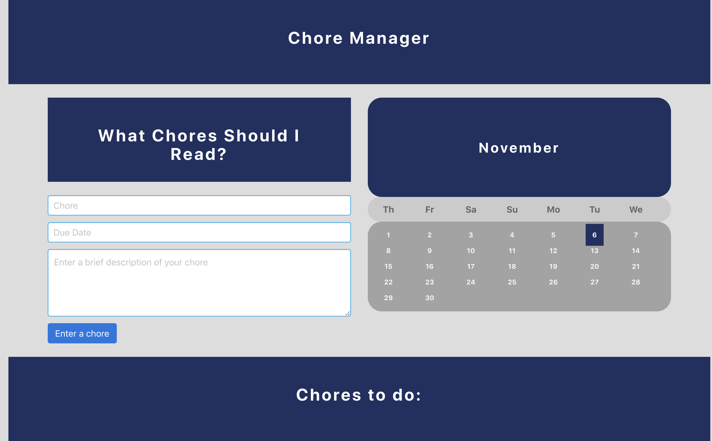

# Chore Manager

This app lets users create a chore/task manager.


* The following image illstrates:





**Technologies Used**

This app uses:

* Bulma
* Bootstrap
* React JS
* Mongoose
* Express
* Node.js

**Link**

Heroku Link (not working): https://sheltered-springs-14396.herokuapp.com/

## Project setup
```
git clone https://github.com/sara9551/project3-help.git
```
```
yarn install
```
```
yarn start
```
```
It will automatically open in \\localhost

